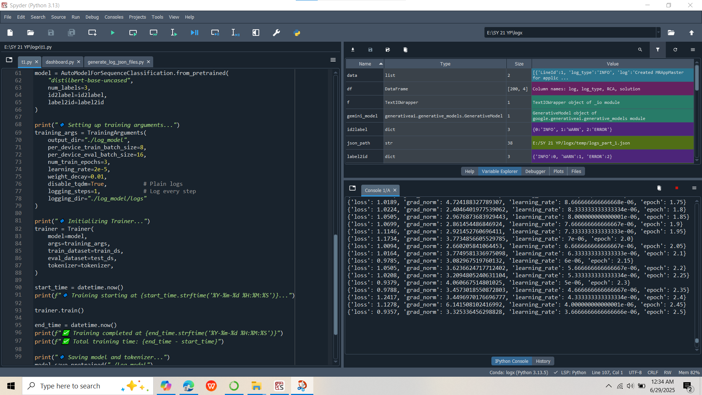

# LOGx - AI-Powered Log Analysis & Incident Response

[](https://www.python.org/downloads/)
[](https://flask.palletsprojects.com/)
[](LICENSE)
[](https://github.com/astral-sh/uv)

## 📋 Project Description

**LOGx** is an intelligent log analysis platform that leverages the Google Gemma 2B AI model to automatically analyze system logs, identify issues, and generate professional incident reports. Perfect for system administrators, DevOps engineers, and security teams who need to process large volumes of logs quickly.

### Key Capabilities:
- **Single Log Analysis**: Classify logs, extract root causes, and get troubleshooting steps
- **Incident Report Generation**: Analyze multiple logs to create comprehensive incident narratives
- **Log Visualization**: Upload CSV files and visualize log patterns with interactive charts
- **PDF Export**: Generate professional incident reports in PDF format
- **GPU Acceleration**: Optimized 4-bit quantized model for fast inference

---

## 🛠️ Tech Stack

| Category | Technology |
|----------|-----------|
| **Backend** | Flask 3.0+, Python 3.10+ |
| **AI/ML** | Transformers, PyTorch 2.0+, Gemma 2B |
| **Data Processing** | Pandas 2.0+ |
| **Package Manager** | UV (next-gen Python package manager) |
| **File Format** | PDF (FPDF2), CSV |
| **Frontend** | Jinja2 Templates, HTML/CSS |
| **API** | Hugging Face Hub (HF Token) |
| **GPU Support** | CUDA 11.8+ (optional) |

---

## ✨ Features

- ✅ **Single Log Classification**: Automatically identifies ERROR, WARN, INFO logs
- ✅ **Root Cause Analysis**: AI-powered detection of underlying issues
- ✅ **Troubleshooting Suggestions**: Actionable remediation steps
- ✅ **Multi-Log Incident Reports**: Comprehensive security incident analysis
- ✅ **Log Visualization Dashboard**: Pattern recognition and frequency analysis
- ✅ **PDF Report Generation**: Professional documentation for stakeholders
- ✅ **GPU Support**: 4-bit quantized model for efficient processing
- ✅ **Web Interface**: User-friendly Flask-based dashboard
- ✅ **Environment Configuration**: Secure token management via .env files

---

## 📦 Quick Start

> ⚡ **Get started in 5 minutes!** See [**QUICKSTART.md**](QUICKSTART.md) for detailed installation and setup instructions.

**Prerequisites:**
- Python 3.10+
- Hugging Face account with API token
- 8GB+ RAM (16GB recommended with GPU)

**Basic Setup:**
```bash
# Clone & setup
git clone https://github.com/yourusername/logx.git
cd logx

# Install dependencies
uv sync

# Set your HF token in .env file
# Then run:
python dashboard.py
```

Visit: [http://127.0.0.1:5000](http://127.0.0.1:5000)

👉 **For complete setup guide**, see [QUICKSTART.md](QUICKSTART.md)

---

## � Screenshots & Visuals

### Model Training Visualization


*LOGx utilizing GPU acceleration for efficient log analysis*

---

## �🚀 Usage Guide

### 1. Single Log Analysis

1. Go to **Home** tab
2. Paste a log message or error:
   ```
   [ERROR] Database connection failed: Connection timeout after 30s at line 245
   ```
3. Click **Analyze**
4. View classification, explanation, root causes, and troubleshooting steps

### 2. Generate Incident Report

1. Go to **Incident Report** tab
2. Paste multiple related logs from a crash/attack scenario
3. Click **Generate Report**
4. Download PDF via **Export as PDF** button

### 3. Log Visualization

1. Go to **Visualization** tab
2. Upload CSV file with columns: `log`, `log_type`
   
   **Sample CSV format:**
   ```csv
   log,log_type
   "Failed authentication attempt",ERROR
   "Service restarted",INFO
   "Memory usage at 85%",WARN
   "Failed authentication attempt",ERROR
   ```
3. View frequency analysis and color-coded patterns (RED=ERROR, ORANGE=WARN, GREEN=INFO)

---

## 📊 Project Structure

```
logx/
├── dashboard.py                 # Main Flask application
├── token.py                     # Token management utilities
├── cache_remover.py            # Cache cleanup script
├── pyproject.toml              # UV package configuration
├── .gitignore                  # Git exclusions
├── README.md                   # This file
├── .env.example                # Environment template (rename to .env)
│
├── templates/                  # Flask HTML templates
│   ├── base.html              # Base layout
│   ├── index.html             # Single log analysis
│   ├── report.html            # Incident report
│   ├── visual.html            # Log visualization
│   ├── about.html             # About page
│   ├── auth.html              # Authentication
│   └── loader.html            # Loading animation
│
├── static/                    # Frontend assets
│   └── style.css              # Stylesheet
│
├── log_model/                 # [Optional] Fine-tuned models
│   ├── config.json
│   ├── model.safetensors
│   ├── tokenizer.json
│   └── checkpoint-*/          # Training checkpoints
│
├── Sample data/               # Example datasets
│   ├── sample_logs.txt
│   └── sample_log_data_set.csv
│
└── tests/                     # Unit tests (recommended)
    ├── test_dashboard.py
    └── test_log_parser.py
```

---

## 🔧 Configuration

For detailed configuration instructions, see [QUICKSTART.md](QUICKSTART.md).

**Basic Environment Variables** (in `.env` file):
```env
HF_TOKEN=hf_xxxxxxxxxxxxxxxxxxxxx  # Required: Hugging Face API token
FLASK_ENV=development              # Optional: Flask environment
FLASK_DEBUG=True                   # Optional: Enable debug mode
```

---

## 📈 Performance Metrics

| Metric | Value |
|--------|-------|
| **Model Size** | 2B parameters |
| **Quantization** | 4-bit (nf4) |
| **Memory Usage** | ~4-6GB |
| **Inference Speed** | ~2-5 sec/log (GPU) / ~10-20 sec (CPU) |

---

## 🧪 Testing & Development

### Run Tests

```bash
# Using pytest
uv run pytest tests/ -v

# With coverage
uv run pytest tests/ --cov=. --cov-report=html
```

### Code Quality

```bash
# Format code (Black)
uv run black .

# Linting (Flake8)
uv run flake8 .

# Type checking (MyPy)
uv run mypy dashboard.py

# Organize imports (isort)
uv run isort .
```

---

## 📋 Sample Output

### Single Log Analysis Response:

```
**Log Type:** ERROR

**Explanation:** 
Database connection failed due to network timeout. The system attempted to establish a connection but exceeded the 30-second timeout threshold.

**Possible Root Causes:**
- Database server is down or unreachable
- Network connectivity issues
- Firewall blocking port
- Database service crashed

**Troubleshooting Steps:**
1. Verify database server status
2. Check network connectivity: ping <db-host>
3. Review firewall rules
4. Check database logs for crashes
5. Restart database service if necessary
```

---

## 📝 API Endpoints

| Endpoint | Method | Purpose |
|----------|--------|---------|
| `/` | GET, POST | Single log analysis |
| `/report` | GET, POST | Generate incident report |
| `/visual` | GET, POST | Log visualization |
| `/report/pdf` | GET | Download report as PDF |
| `/about` | GET | About page |

---

## 🤝 Contributing

Contributions welcome! Please:

1. Fork the repository
2. Create a feature branch: `git checkout -b feature/your-feature`
3. Commit changes: `git commit -am 'Add feature'`
4. Push to branch: `git push origin feature/your-feature`
5. Submit pull request

### Code Style:
- Use Black for formatting
- Follow PEP 8
- Add docstrings to functions
- Write type hints

---

## 🐛 Troubleshooting


**Quick Help:**
- HF_TOKEN error → Set environment variable in `.env`
- Port 5000 in use → Change port in `dashboard.py`
- Out of memory → Use CPU instead of GPU

---

## 📚 Documentation

- **[DEPLOYMENT.md](DEPLOYMENT.md)** - Production deployment guide
- **[CONTRIBUTING.md](CONTRIBUTING.md)** - How to contribute


---

## 📄 License

This project is licensed under the MIT License - see [LICENSE](LICENSE) file for details.

---

## 👤 Author & Contact

**Your Name**
- 📧 Email: yashparaskar2@gmail.com
- 🐙 GitHub: [@yourusername](https://github.com/Yash010111)
- 🔗 LinkedIn: [Your Profile](https://www.linkedin.com/in/yash-paraskar-97a873271/)

### Project Links:
- 🌐 Homepage: [GitHub Repository](https://github.com/Yash010111/logx)
- 📖 Documentation: [Wiki](https://github.com/Yash010111/logx/wiki)
- 🐛 Issues & Support: [GitHub Issues](https://github.com/Yash010111/logx/issues)

---

## 🙏 Acknowledgments

- Google for Gemma 2B model
- Hugging Face for transformers library
- Flask community
- PyTorch team

---

## 📌 Changelog

### v1.0.0 (2026-02-26)
- Initial release
- Single log analysis
- Incident report generation
- Log visualization
- PDF export
- GPU support with 4-bit quantization

---

**⭐ If this project helped you, please consider giving it a star on GitHub!**

---

*Last Updated: February 26, 2026*
